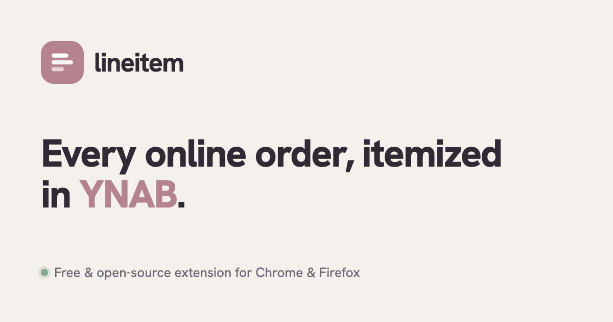

<div align="center">



<h1>lineitem</h1>

**Answers "what did I actually buy?" for your YNAB transactions.**

Matches an Amazon or Target charge to the order behind it, reads the line items,
categorizes each one, and writes the split back to YNAB — after you approve.
Your order data never leaves your browser.

[](https://github.com/michael-bachmann/lineitem/actions/workflows/ci.yml)
[](https://codecov.io/gh/michael-bachmann/lineitem)
[](LICENSE)
[](https://lineitem.dev)
[](https://lineitem.dev)
[](https://wxt.dev/)
[](https://www.typescriptlang.org/)
[](https://react.dev/)
[](https://tailwindcss.com/)
[](https://workers.cloudflare.com/)

[**Website**](https://lineitem.dev) · [Privacy](https://lineitem.dev/privacy) · [Report an issue](https://github.com/michael-bachmann/lineitem/issues/new) · [Linear board](https://linear.app/bachmann/project/lineitem-4a139fb6940b)

</div>

---

## Why

A single `$42.98` Amazon charge is never one budget category. It's groceries,
household, and a phone case — but in YNAB it lands as one opaque line on the
payee. lineitem opens that charge up: it pulls the **real items behind it**,
categorizes each from your own history, and splits the transaction so your
budget reflects what you actually bought.

## How it works

```
YNAB charge  →  match order  →  read line items  →  categorize each  →  write split (you approve)
```

1. **Match** — finds your recent Amazon and Target charges in YNAB and pairs each
   one with the order behind it.
2. **Itemize** — scrapes the order's line items, with thumbnails, directly in your
   browser.
3. **Categorize** — suggests a YNAB category per item from your own history, backed
   by on-device embeddings for items it hasn't seen before. Adjust anything, or
   apply one category to the lot.
4. **Split** — writes the split back to YNAB in one tap. If every item maps to the
   same category it posts as a plain transaction; otherwise as a split. **Nothing
   changes in your budget until you approve it.**

## Privacy

Order scraping, categorization, and embeddings all run **locally in your browser**.
Your purchase history never leaves the device. The only network calls are to YNAB
(your own budget data) and to a thin [OAuth proxy worker](#oauth-proxy-worker) that
attaches the YNAB `client_secret` to token exchanges — it brokers auth, never your
orders. See the [full privacy policy](https://lineitem.dev/privacy).

## Repository layout

pnpm workspace (`apps/*`, `packages/*`):

```
.
├── apps/
│   ├── extension/         # WXT MV3 extension
│   │   ├── entrypoints/   # side panel UI, background service worker, content scripts
│   │   ├── components/    # extension-specific React UI (queue, detail view, settings, backfill, …)
│   │   ├── lib/           # domain code: oauth, ynab API, settings, types, distribution, classifier, db, money
│   │   ├── background/    # service-worker handlers: sync, backfill, approval, embedder, embedding eviction
│   │   ├── retailers/     # per-retailer adapters (amazon, target) + registry
│   │   └── wxt.config.ts  # manifest config (permissions, host permissions, pinned key)
│   ├── landing/           # lineitem.dev marketing + privacy site (Vite + React)
│   └── worker/            # Cloudflare Worker — holds the YNAB OAuth client_secret
└── packages/
    └── ui/                # @lineitem/ui — shared design tokens + presentational React primitives
```

Commands run per-package via `pnpm --filter <extension|landing|worker> <script>`.

## Tech stack

- **[WXT](https://wxt.dev/)** — MV3 extension framework; one codebase builds for Chrome + Firefox
- **React 19** + **Tailwind 4** for the side panel UI
- **TypeScript 5.9** in strict mode
- **[transformers.js](https://huggingface.co/docs/transformers.js)** with `Xenova/bge-small-en-v1.5` (q8) for on-device item-title embeddings
- **IndexedDB** for persistent storage: `categories`, `learnedProducts`, `productEmbeddings`, `allocatedTransactions`
- **[Cloudflare Workers](https://workers.cloudflare.com/)** for the OAuth secret proxy at [auth.lineitem.dev](https://auth.lineitem.dev/)
- **[remeda](https://remedajs.com/)** for typed utility helpers (`sum`, `groupBy`, `partition`, `sortBy`, …)
- **vitest** + **happy-dom** for tests, colocated as `*.test.ts` next to source across `lib/`, `background/`, `retailers/`, and `components/`

## Quick start

```bash
pnpm install                         # once

pnpm --filter extension dev          # Chrome → apps/extension/.output/chrome-mv3/
pnpm --filter extension dev:firefox  # Firefox → apps/extension/.output/firefox-mv2/
```

Then in `chrome://extensions`: enable **Developer mode** → **Load unpacked** →
pick `apps/extension/.output/chrome-mv3/`. The pinned `manifest.key` gives a
stable extension ID (`eahcpeohilmkjagfpdfocfjgaoeghghb`) across machines.

Production build (store packaging, tighter CSP than dev):

```bash
pnpm --filter extension build
pnpm --filter extension zip          # store-ready zip
```

## Tests

```bash
pnpm --filter extension test:run     # vitest — lib/, background/, retailers/, components/
pnpm --filter worker test            # vitest — worker src/
pnpm --filter extension compile      # tsc --noEmit (extension)
pnpm --filter worker compile         # tsc --noEmit (worker)
```

## OAuth proxy worker

The extension uses YNAB OAuth (Authorization Code Grant with silent refresh).
YNAB requires `client_secret` on every `/oauth/token` call — even with PKCE — and
a browser extension can't safely embed secrets, so token exchanges route through a
Cloudflare Worker. Two endpoints, both injecting `YNAB_CLIENT_ID` +
`YNAB_CLIENT_SECRET` from Cloudflare's encrypted env vars before forwarding to YNAB:

| Endpoint | Purpose |
| --- | --- |
| `POST /oauth/exchange` | swap an authorization code for tokens |
| `POST /oauth/refresh` | rotate an access token via the stored refresh token |

Deploy:

```bash
pnpm --filter worker exec wrangler login
pnpm --filter worker exec wrangler secret put YNAB_CLIENT_ID
pnpm --filter worker exec wrangler secret put YNAB_CLIENT_SECRET
pnpm --filter worker deploy
```

Then attach the custom domain in the Cloudflare dashboard: **Workers & Pages →
`lineitem-oauth` → Settings → Domains & Routes → Add → Custom domain →
`auth.lineitem.dev`**. DNS and TLS provisioning are automatic (~2 minutes to
"Active").

Smoke test the full chain (domain → worker → YNAB):

```bash
curl -i -X POST https://auth.lineitem.dev/oauth/exchange \
  -H 'content-type: application/json' \
  -d '{"code":"x","redirect_uri":"y"}'
```

Expected: **HTTP 400** with a YNAB error body — proves the chain is wired.

Register the redirect URI `https://<extension-id>.chromiumapp.org/` on the YNAB
OAuth app. The extension ID is pinned via `manifest.key` in `wxt.config.ts`, so it
stays stable across machines.

## Conventions

- **Currency** — all monetary values are integer cents in code. Conversion to YNAB
  milliunits happens only at the API boundary (`millunitsToCents` / sign-flip in
  `buildSubtransactions`).
- **Storage** — IndexedDB store names are stable for migrations; TypeScript-level
  field renames don't touch the persistence layer.
- **Retailer adapters** — each adapter owns its full tab lifecycle (open → navigate
  → scrape → close). The pipeline composes adapters but doesn't manage tabs.
- **Tests** — colocate with the code (`foo.ts` ↔ `foo.test.ts`). Mock at the
  function boundary, not the network. Behavioral tests over implementation tests.
- **Functional style** — prefer pure helpers and remeda's
  `reduce`/`map`/`filter`/`groupBy`/`partition` over mutation.
- **Comments** — describe *why*, not what. Code identifiers handle the "what."

## Contributing

Issues and work are tracked in [Linear](https://linear.app/bachmann/project/lineitem-4a139fb6940b)
(Bachmann team, `BAC-` prefix). Found a bug or have a request?
[Open an issue](https://github.com/michael-bachmann/lineitem/issues/new).

## License

[MIT](LICENSE) © 2026 Michael Bachmann
